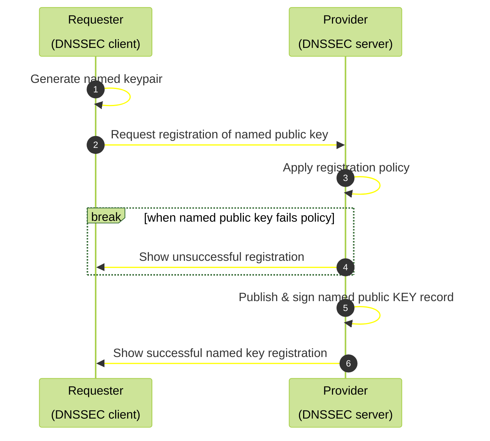
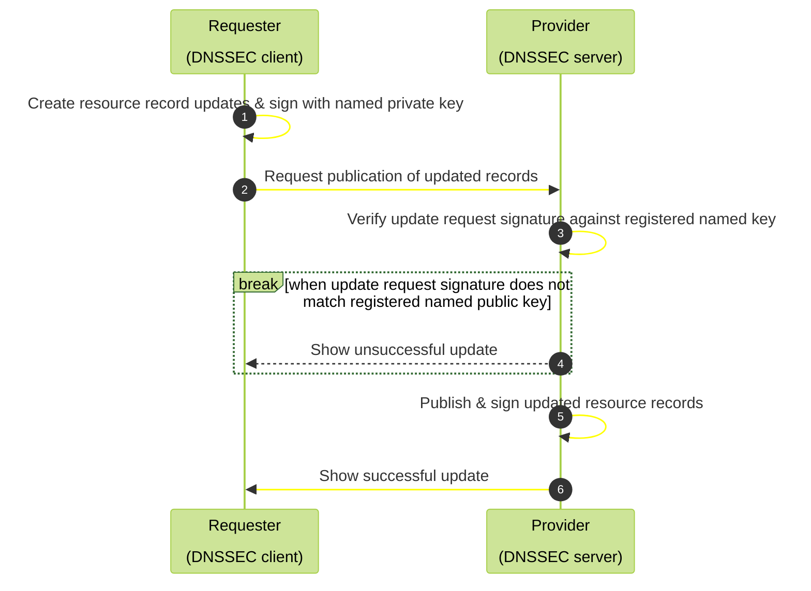

+++
title = 'README'
layout = 'posts'
date = 2024-04-10T11:12:15+02:00
draft = false
featured_image = '/images/mycosystem-quarter.jpg'
#featured_image = ""
toc = true
+++

## 🚧 Work in progress

sig0namectl is a proof of concept set of tools that enable a secure, direct & scalable standard SIG(0) key based authentication to allow users to manage & further delegate update rights to DNS resource records within compatibly configured DNSSEC enabled zones.

##  📝 Prepare

Install dependencies.

To keep extra dependencies to a minimum and to allow use in constrained environments, these tools are implemented in Bash and use a subset of BIND9 DNS tools.

For Debian and derivatives:

`apt install bind9-dnsutils`

For Fedora and related distributions and derivates

`dnf install bind-utils`

## 💾 Install

No system install yet. Clone this git repository and use from working directory. Note: Currently tools must be used from working directory.

## 🎮 Quick start

### Registering a named key

By default, DNS key labels beneath a compatible domain can be claimed on a "First Come, First Served" (FCFS) basis.

To request a key registration within a compatible domain (*zenr.io* is an example domain for a public playground), use the `request_key` tool, specifying the fully qualified domain name (FQDN) of the new domain you wish to control. For example, under the *zenr.io* domain, issuing:

`request_key mysubdomain.zenr.io`

will create a new ED25519 keypair in your local keystore (where '*my_subdomain*' is unclaimed on a FCFS basis).

The successful registration can be verified by

`dig mysubdomain.zenr.io KEY`

returning the listed public key for the specific FQDN.

the keypair is enabled to add, modify or delete any DNS resource record at or under [*.]*mysubdomain.zenr.io*.

Note: It may take a minute or so for your local DNS resolver to update its cache with the new key.

### Updating resource records with a named key

To manage a fully qualified domain name, you will need the keypair for that FQDN in your local keystore directory (./keystore). Advanced users can use -k and -s flags to specify other keys when needed.

#### `dyn_ip fqdn [ip4]|[ip6] ...`

Manages A & AAAA records for the specified fully qualified domain name, fqdn. 

#### `dyn_loc fqdn`

Updates LOC records for fqdn from GPS source (currently compatible with Android mobile devices using termux-location).

#### `dnssd-domain fqdn`

Manages DNS records necessary to activate wide area DNS Service Discovery browsing.

#### `dnssd-service fqdn`

Gives an *example* of how to register browsable wide area DNS-SD services.

#### `nsupdate -k path_to_keypair_prefix`

Successfully registered keypairs are stored in your local keystore and also can be used with the standard DNS tool, `nsupdate` (using -k option to specify the keypair prefix filepath). See `man nsupdate` for further details.

***
**[🔝 back to top](#toc)**

## 😍 Acknowledgements

Copyleft (ɔ) 2022 Adam Burns, [free2air limited](https://free2air.net) & the [Dyne.org](https://www.dyne.org) foundation, Amsterdam

Designed, written and maintained by Adam Burns.

**[🔝 back to top](#toc)**

***
## 🌐 Links

**[🔝 back to top](#toc)**

***
## 👤 Contributing

1.  🔀 [FORK IT](../../fork)
2.  Create your feature branch `git checkout -b feature/branch`
3.  Commit your changes `git commit -am 'Add some fooBar'`
4.  Push to the branch `git push origin feature/branch`
5.  Create a new Pull Request
6.  🙏 Thank you

**[🔝 back to top](#toc)**

***
## 💼 License
    sig0namectl - 
    Copyleft (ɔ) 2023 Adam Burns, free2air limited & Dyne.org foundation, Amsterdam

    This program is free software: you can redistribute it and/or modify
    it under the terms of the GNU Affero General Public License as
    published by the Free Software Foundation, either version 3 of the
    License, or (at your option) any later version.

    This program is distributed in the hope that it will be useful,
    but WITHOUT ANY WARRANTY; without even the implied warranty of
    MERCHANTABILITY or FITNESS FOR A PARTICULAR PURPOSE.  See the
    GNU Affero General Public License for more details.

    You should have received a copy of the GNU Affero General Public License
    along with this program.  If not, see <http://www.gnu.org/licenses/>.

**[🔝 back to top](#toc)**
